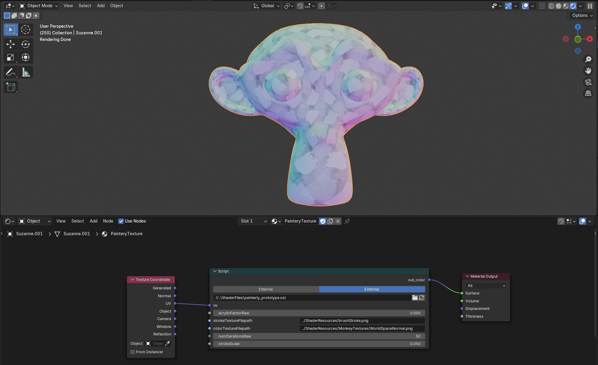
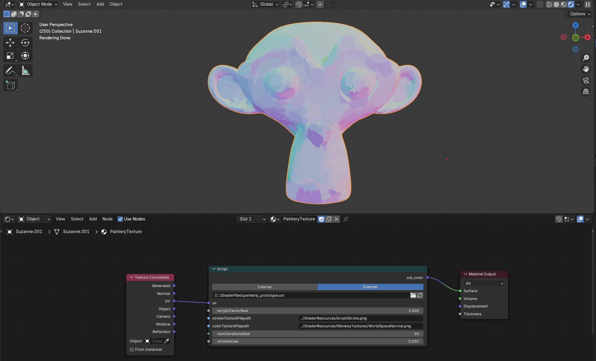
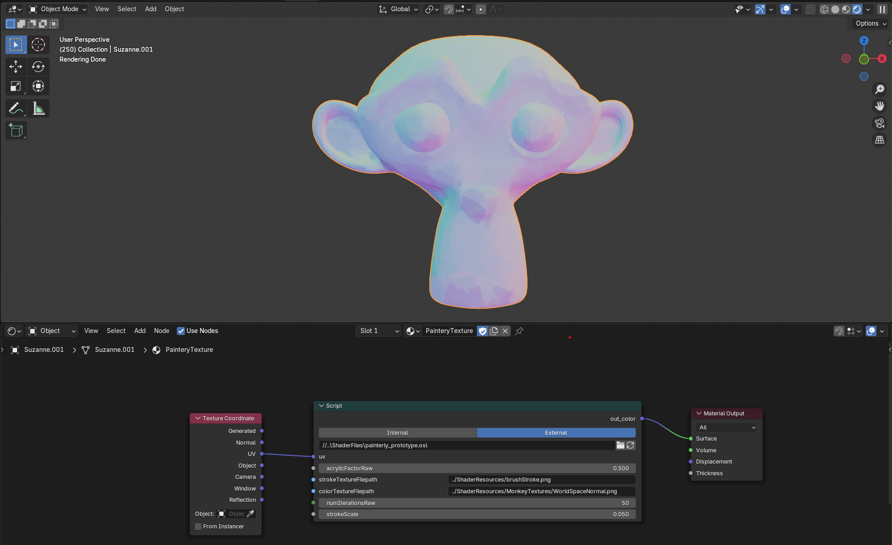

# Painterly Automation

## Overview
Painterly Automation is an all-in-one OSL script that helps 3D artists texture their models with an acrylic or watercolor painterly style, allowing the user to drive the amount of Acrylic and Watercolor they want the paint to have with a slider. The Painterly Automation script is cross-compatible and can be used in any 3D software with OSL support such as Blender or Maya.

Painterly Automation can be used to paint-ify any texture map. This includes maps such as albedo, normal, roughness, metalic etc. to be driven by the script's unique painterly effect in how the object interacts with scene lighting.

## Demos
### Dependencies
Must have Blender 4.3.x or Maya 2025 installed.
- Blender: https://www.blender.org/download/
- Maya: https://www.autodesk.com/products/maya/free-trial

### How to run the demos
#### Blender
- Download this repo as a zip and extract it
- Navigate to the "Demos/" folder, and open the "Demos/blenderPainterlyDemo.blend" file
- Navigate to the Shading tab in Blender
- Select the "Viewport Shading (render)" option (on the top right)
- To enable OSL in Blender, follow the instructions here: https://docs.blender.org/manual/en/latest/render/shader_nodes/osl.html

## How to use (for people experienced with Blender and Maya's node editors)
The Painterly Automation OSL script can be used in both Maya and Blender with the built-in "aiOslShader" node and "Script" node respectively. 

The script takes in two file paths, one image texture for the desired brush stroke, and another image texture for the desired object texture to be paint-ified. It also takes the object's UV-Coordinate Map as input as well as an acrylic slider and Iteration count which drive how acrylic or watercolor you want the paint to be, and the amount of paint you want on the texture.

For Blender: Create a script node, then attach the script as an external file and compile it. The UV input can be accessed via the Texture Coordinate node with the UV channel and the output can be accessed via the color output from the script node. Plug this output map into the BSDF to drive your desired channel.

For Maya: In the hypershade editor, create an aiOslShader node, then import the script and compile it. The UV input can be accessed via the place2dTexture Node and the output can be accessed via the Out Color channel of the OSL shader node. Plug this output map into the aiStandardSurface to drive your desired channel.

## Sceenshots
- Watercolor effect

- Acrylic effect

- Watercolor-acrylic halfway blend effect

